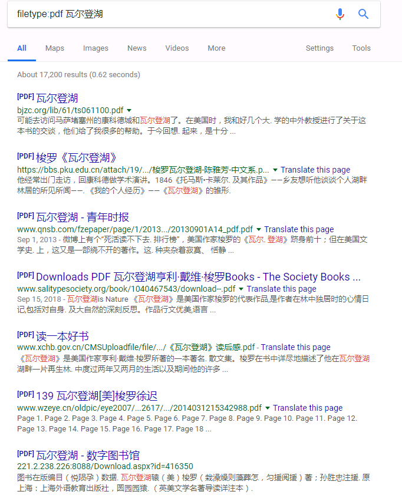
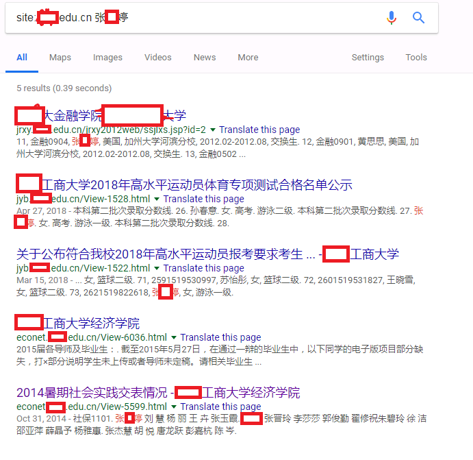
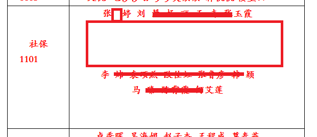

# IT Cookbook for Beginners

写给初学者的IT学习路线索骥图，笔者才疏学浅，权当抛砖引玉。

## 为什么写

笔者当年大学所学专业为机械设计，在校期间较多摸索电路设计，偶尔涉及程式开发，毕业后从事软件开发的工作。

曾有很多的同学跟我探讨如何零基础学习编程，编程并不是一项专属技能，而是一整套的思考方式与解决问题的策略。

这里笔者从个人的非科班从业经验的角度，来对过往的经历和一些思考作以记录，希望能够给向我咨询的同学和朋友一些启发和帮助。

另外，在动笔写之前，在网络上的搜寻过相关资料，笔者没有找到比较系统的从零开始的系统化参考路线，大多数都是偏向某个知识点或面，这也是萌生写这篇简稿的原因之一。

仅为提纲，陈述大体的结构，细节部分需要读者自己结合自身的情况加以补充，有机会也可以单独来起写篇幅。

## 如何阅读

这篇短文不是方法论，你可以把她理解为一张出行地图，具体你是步行、是走小路、又或是负重，这些都是需要读者自己根据自身的情况决定，拙文仅做参考。

思考逻辑远比知识储备重要！作为新手，与其囫囵吞枣地刷某门编程语言，不如先强化好自己的思维方式和思考问题的习惯，接下来笔者就以自身的理解来阐述一下所谓的思维方式。

## 思维方式

推荐书籍：

1. 《黑客与画家》

---

1. 视野决定格局，一定要涉猎广泛，知识才能用得融会贯通。
2. 不把自身的技术局限在某个点上，什么时候都可以从零开始新的技术，技术的圈子更新迭代很快，需要持续的学习。笔者听过很多：“我写Python的，这个不会”、“我没做过逆向”，这都是不推荐思维方式。Steve Jobs说：Stay hungry, stay foolish。
3. 实践出真知，临渊羡鱼，不如退而结网。
4. 在技术上，人人都应该是完美主义者。
5. 重复3次或以上的工作，就要考虑自动化。
6. 互联网总有你想要的答案，但是需要时间成本。
7. 保持好奇。

## 通识篇

> 通识知识，笔者认为，即便不从事软件开发工作，也应该需要了解和掌握的一些技巧。

### 软件工具

1. 浏览器：Chrome、Firefox
2. 文本编辑器：Sublime Text、Visual Studio、Notepad++
3. 输入法：RIME
4. 梯子：*ShadowSocks(R) 配合Free的共享节点*,**仅做参考，没有亲身试用**
5. HTTP(s) 抓包：Fiddler、Burp suite、Charles
6. 压缩解压：7-zip
7. 文本书籍相关：Calibre、Pandoc

### 在线服务

1. 搜索引擎（基本且重要）：Google（不能访问的可以找镜像，如：https://plus.likeso.ml/）
2. 任务管理：Trello
3. Office：Google docs、Office 365、Airtable
4. 设计：Figma
5. 在线笔记：Evernote、Notion

### 浏览器插件

1. 代理切换：SwitchOmega
2. 性能：OneTab
3. 工具：Xpath

### 基本知识

1. 网络：TCP/IP、ip地址、域名、DNS、URI/URL、HTTP协议、WebSocket、抓包、浏览器的调试
2. 代码：基本的JavaScript、HTML、CSS
3. 文本处理：正则、CSS Selector
4. 搜索引擎规则：如，`site:`、`+`、`type`等，图片搜索等

### 实例

1. 小王最近想看《瓦尔登湖》的PDF版。
2. 小王是某工商大学的学生，想认识学校里一个叫张 * 婷的女生，但是没有其他信息，只知道她的名字。
3. 小王想拷贝某乎上的问题答案，右键复制发现提示版权保护，无法拷贝内容。

下面或为高效率步骤：

问题1：
1. Google搜索`filetype:pdf 瓦尔登湖`

结果：

问题2：

1. Google搜索`**工商大学`得到Host`----.edu.cn`
2. Google搜索`site:hzic.edu.cn 张 * 婷` 
3. 基本上每条结果都比较价值，从最后一条结果中得到第一个有价值的信息：**社保1101班**

问题3：

1. 右键，`查看网页源码`
2. `Ctrl+F`定位到想要复制的内容

> 原则上，所遇到的问题都可以通过`在线服务`的`1`来解决。

## 技术篇

### 未来方向

1. 产品思维，知道自己要什么，然后知道用到哪些技术来实现
2. 技术路线，性能到极致，挑战技术难点，类似越狱、百万并发、算法模型准确率等